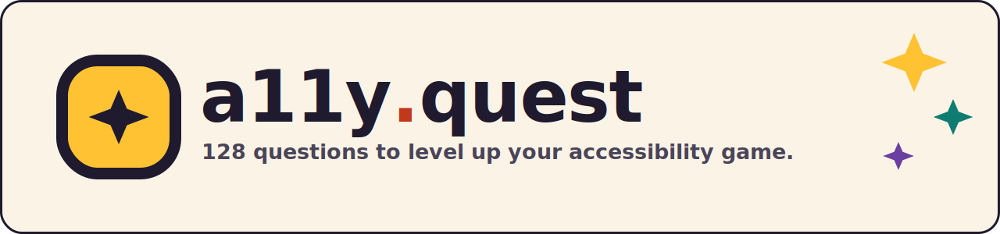

<p align="center">
  
</p>

# a11y.quest

[](https://github.com/thedavedavies/a11y.quest/actions/workflows/ci.yml)

A web-accessibility drill of 128 questions to level up your game. Answer a question, see
whether you were right with a plain-English explanation and links to the source docs, then
keep going. Your run (answered, correct, accuracy, current streak, best streak) is saved
locally.

Live at **https://a11y.quest**.

## What it tests

Technical web accessibility: WCAG 2.2 success criteria, WAI-ARIA, semantic HTML, keyboard
and focus, screen readers and assistive tech, colour contrast, and name/role/value, whether
you are learning, brushing up, or prepping for a certification.

## Features

- A bank of 128 multiple-choice questions, served in a fresh random order with no repeats
  until you have seen them all, then reshuffled so you can keep drilling.
- Instant feedback with a plain-English explanation and links to the authoritative docs.
- A persistent run score: answered, correct, accuracy, current streak, and best streak.
- A shareable score card with a server-rendered social image

## Tech stack

- [Astro](https://astro.build) with TypeScript.
- Plain CSS with design tokens driven by the CSS `light-dark()` function.
- [Cloudflare Workers](https://workers.cloudflare.com) for hosting (static assets plus a small
  Worker in `worker/` for the share-card OG image and per-share meta tags).
- Vitest (with axe-core) and Playwright for testing.

## Getting started

You need Node 20 or newer.

```bash
npm install
npm run dev        # local dev server
```

Other scripts:

```bash
npm run build         # production build
npm run preview       # preview the production build
npm run check         # astro + TypeScript checks
npm run lint          # eslint, including accessibility rules
npm run test          # unit and integration tests, incl. axe-core checks
npm run test:browser  # Playwright accessibility pass in a real browser
```

## Contributing

Contributions are welcome, especially new questions. See [CONTRIBUTING.md](CONTRIBUTING.md)
for the question format, the accessibility bar every change must meet, and the dev workflow.
Spotted a wrong or unclear question? Use the in-app "report a problem" flag, or open an issue.

## License

[MIT](LICENSE) (c) Dave Davies
